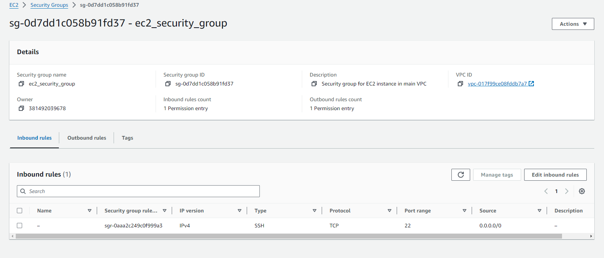

# FireFly Home Assignment:

# Part 1:

###  1. Create a Free Tier AWS account: 
I already have an AWS account. However, it's important to avoid using the root account for security reasons. Instead, I created a secondary IAM user account with the necessary permissions, which I use exclusively for my projects. This ensures better security and follows AWS best practices.

### 2. Done

### 3. Create an EC2 instance with a dedicated VPC and Subnet:
In order to perform the task, I created the following files:

### Files Explanation:
- network.tf :

    Defines the VPC, Subnet, Internet Gateway, Route Table, and associations.
    Sets up the basic networking infrastructure required for the EC2 instance.


- key_pair.tf :

    Generates an SSH key pair for secure access to the EC2 instance.
    Saves the private key locally and stores the public key in AWS as a key pair.


- ec2.tf :
    Provisions an EC2 instance in the public subnet.


- securitygroups.tf :

    Creates a Security Group allowing SSH access on port 22.
    Ensures outbound traffic is unrestricted.




- variables.tf :

    Defines all configurable variables (AMI ID, instance type, key pair name, etc.) used across the Terraform files.

- outputs.tf :

    The outputs.tf file defines the values that Terraform displays after executing a plan or apply
---

#### each file contains detailed explanation !

#### Any file that does not appear in the explanation is a file created in later sections of the assignment

---
### Apply the Files and SSH into the EC2 Instance:
1. First i configured the AWS CLI: I Run the following command to set up my AWS credentials:
    ```
    aws configure
    ``` 
    Enter the AWS Access Key, Secret Key, and the region when prompted.

2. Run Terraform Commands: I Used the following sequence of Terraform commands to initialize, format, validate, and apply the infrastructure configuration:
```
terraform init           # Initializes the Terraform working directory
terraform fmt            # Formats the Terraform files to ensure consistency
terraform validate       # Validates the Terraform configuration files
terraform plan           # Creates an execution plan and previews changes
terraform apply          # Applies the plan and creates the infrastructure
```


3. Retrieve the EC2 Public IP: Once Terraform finishes creating all the resources, the public IP address of the EC2 instance will be displayed in the output.

4. SSH into the EC2 Instance: I Used the following command to SSH into the instance:
```
ssh -i my-key-pair.pem ec2-user@3.84.119.217
```


### 4. Create an S3 bucket:
To create an S3 bucket, I used the '5-s3Bucket.tf' file.

This configuration creates a private S3 bucket with a unique name, ensuring uniqueness by appending a random string to the bucket name. The bucket is also tagged for easy identification.


### 5. Connect to the EC2 instance using the AWS CLI or the UI:
using the  AWS Management Console: 


using the  AWS Command Line Interface: 

- Step 1: Ensure EC2 Instance Has the Required IAM Role

    Attach the AmazonSSMManagedInstanceCore policy to your EC2's IAM role.

- step 2: Run the Session Manager Command:
```
aws ssm start-session --target <INSTANCE_ID>
```


### 6. Create a text file using the echo command containing the word "Firefly"::
Once connected, I used the following command to create a text file:
```
echo "Firefly" > firefly.txt
```
This command generates a file named firefly.txt containing the word "Firefly".


### 7. Write the file from the EC2 terminal to the S3 bucket:
To ensure the AWS CLI is properly installed, I used the following command:
```
aws --version
```


Initially, I tried to list all the S3 buckets:

This resulted in an Access Denied error, as shown below:


To grant the EC2 instance access to the S3 bucket, I followed best practices by assigning an IAM role to the instance. This allows secure access without requiring AWS credentials on the instance.

with the following steps:

- Step 1: Create an IAM Role and Policy Using Terraform ('6-IAM.tf')

- Step 2: Attach the IAM Role to the EC2 Instance:
    ``` 
    iam_instance_profile = aws_iam_instance_profile.ec2_profile.name
    ``` 
- Step 3: Apply the Terraform Configuration
     ```
    terraform fmt
    terraform validate
    terraform plan
    terraform apply
    ```

- Step 4: Upload the File to the S3 Bucket
 
    After assigning the IAM role, I connected to the EC2 instance via SSH again. I recreated the firefly.txt file:

    ```
    echo "Firefly" > firefly.txt
    ```

    Then, I used the following command to upload the file to the S3 bucket:
    ```
    aws s3 cp firefly.txt s3://firefly-bucket-kf1jpa
    ```

- Step 5: Verify the File Upload
    Finally, I listed the contents of the S3 bucket to ensure the upload was successful:
    ```
    aws s3 ls s3://firefly-bucket-kf1jpa/

    ```
    

    

-------------------------------------------------------------
-------------------------------------------------------------
-------------------------------------------------------------
# Part 2:

### 1. Configuration Modification

### A:
-  EC2 instance: 

    before: 

    

    After: 

    

-  security group:

    before: 

    

    After: 

    

### B: Use TF to identify those changes:

After making these manual changes, I used Terraform to detect what changed using the command: 
```
terraform apply -refresh-only 
```


 


### C. Use TF to align your IaC in order to remediate those change: 

- Steps to Align IaC Using Terraform

    1. By enter 'yes' The command will update the Terraform state to reflect the current status of the infrastructure (including manual changes).
    It will not modify any real infrastructure—it only ensures the state file is in sync with the existing resources.

    2. Modify my Terraform Code: To prevent Terraform from attempting to remove these changes in the future, i need to reflect them in my code. 

        - I added the Vendor Tag in ec2.tf: 
        ```
        tags = {
            Name   = "${var.ec2_instance_name}-instance"
            Vendor = "Firefly"  # Add this tag back
        }
        ``` 
        
        - I Updated the Security Group Rules in securitygroups.tf:
        ```
        ingress {
            from_port   = 22
            to_port     = 22
            protocol    = "tcp"
            cidr_blocks = ["0.0.0.0/0"]  
        }
        ``` 

    3. Validate and Apply Terraform Changes:
    
        Once the Terraform code reflects the desired state, run the following commands:
        ```
        terraform fmt
        terraform plan
        ```


 

### 2. Learning new S3 bucket attributes:

I tried to Modify my S3 resource block to include the versioning configuration by adding: 
```
versioning {
    enabled = true  # Enable versioning
  }
```
The output : 


Why This Happens? 

Terraform has moved towards modularity and separation of concerns. Managing versioning independently through the aws_s3_bucket_versioning resource makes it easier to update or change the versioning configuration without impacting the S3 bucket resource itself.

So Here’s how I adjusted my Terraform configuration to enable versioning using the correct approach:

This separate resource enables versioning on the existing S3 bucket.

```
resource "aws_s3_bucket_versioning" "firefly_versioning" {
  bucket = aws_s3_bucket.firefly_bucket.id

  versioning_configuration {
    status = "Enabled"  # Enable versioning for the bucket
  }
}
```
Apply the Changes:
```
terraform plan
```
The output : 


```
terraform apply
```


Before: 


After: 


#### what is Versioning?
Amazon S3 Versioning, originally launched in 2010, provides an additional layer of protection by storing multiple versions of an object in the same S3 bucket, so you will be able to preserve, retrieve, and restore any version of an object stored in the bucket.

#### When Should You Use Versioning?
1. Accidental Overwrites: Prevents data loss by keeping all versions of an object.
2. Accidental Deletions: Restores deleted objects from previous versions.
3. Audit and Compliance: Track all versions of critical data for auditing purposes.

### 3. Security Group Creation and Integration with Terraform:

### A: Create a New Security Group Using the AWS Console:


### B: Import the Security Group into Terraform:
Steps to Import the Security Group Successfully:
1.  Create a Placeholder Resource in securitygroups.tf by adding the following block to securitygroups.tf:
```
resource "aws_security_group" "new_sg" {
  name        = "new-ec2-security-group"  gave earlier
  description = "The Security group for part 2 task 3"
  vpc_id      = aws_vpc.firefly_vpc.id  

ingress {
    cidr_blocks = [
      "0.0.0.0/0" # Allows incoming traffic from any IP address
    ]
    from_port = 22    # Allows traffic on port 22 (SSH)
    to_port   = 22    # Specifies the destination port (SSH)
    protocol  = "tcp" # The protocol to use (TCP in this case)
  }
  ingress {  # these was added as part of part 2 task 1. 
    from_port   = 80
    to_port     = 80
    protocol    = "tcp"
    cidr_blocks = ["0.0.0.0/0"] # Allows HTTP from anywhere
  }

  egress {
    from_port   = 0             # Allows all outbound traffic
    to_port     = 0             # All destination ports
    protocol    = -1            # -1 allows all protocols
    cidr_blocks = ["0.0.0.0/0"] # Allows outbound traffic to any IP
  }
}
```
2. Import the Security Group into Terraform:
Once the placeholder is in place, I did the import command:
```
terraform import aws_security_group.new_sg sg-08dc45615e1b50bdf
```
This command associates the manually created security group with the Terraform state file.

the output:


3. Verify the Import: I did the following commands to verify that the security group was imported correctly:
```
terraform plan
```
the output:


### c: Update the EC2 Instance Configuration to Use the New Security Group:
The Original EC2 Configurations: 


I Modified my EC2 instance configuration in the ec2.tf file to replace the old security group with the new one :
```
  vpc_security_group_ids = [aws_security_group.new_sg.id]  # Use the new security group
```

Then I applied the changes:
```
terraform validate
terraform plan
terraform apply
```


The new EC2 Configurations: 


### 4.  which feature did you find the most interesting?:

During my exploration of Firefly, two features stood out:  Codifying Unmanaged Terraform Assets and also the Guardrails feature.  

Codifying Unmanaged Terraform Assets -  This feature simplifies the process of identifying unmanaged cloud resources and converting them into Terraform code, ensuring they are brought under infrastructure-as-code (IaC) management.

Guardrails -  that allows cloud engineers to define, enforce, and automate policies across multiple cloud environments, ensuring that resources remain secure, cost-efficient, and compliant with industry best practices. 

How Codifying Adds Value to Cloud Engineers:

- Untracked or manually created resources are a common issue, that increased risks. Firefly scans cloud infrastructure and highlights unmanaged resources, that way engineers gain control over untracked resources and ensures they align with IaC principles

- Once the resources are identified, Firefly generates Terraform code snippets. Engineers can quickly onboard these resources into IaC workflows, saving time and effort.

- By automating the codification process, Firefly eliminates the need for manual tracking and coding, reducing the likelihood of human errors. 

How Guardrails Add Value to Cloud Engineers:

- Proactive Compliance and Security:
Guardrails catch misconfigurations early, minimizing risks like data breaches (which cost an average of $4.5 million per incident). 

- Cost Optimization:
Firefly enforces budgets, tracks spending, and detects cost anomalies, ensuring efficient resource management and avoiding overspending.

- Resource Visibility and Control:
Resource enforcement guardrails control the creation, modification, and deletion of resources, ensuring that only authorized and appropriate changes are made to the infrastructure

- Auto-Remediation:
Firefly’s auto-remediation scans for violations, suggests Terraform fixes, and applies them with one click, saving time and reducing manual intervention.


